# Android medication reminder flow

This walkthrough documents the Android-first reminder flow and its native home-screen widget. Every screenshot was captured from the `JananCapture` Android Virtual Device, configured from a Pixel 10 Pro profile. The selected device was `emulator-5554`, logical display 0, at 1280 × 2856. No physical phone was used for these captures. The product scope is in the [Medication reminders plan](medication-reminders-plan.md).

The example uses demo data: Amlodipine 5 mg at 8:00 AM on weekdays. The sample dose is marked Taken only to demonstrate the recorded-dose and widget states.

## Build and setup

### Select the emulator for capture

1. Call PolyScreen `mobile_devices_list` and select the device whose serial is `emulator-5554` and product is `sdk_gphone64_x86_64`.
2. Call `mobile_displays_list` with serial `emulator-5554`; select logical display `0` (`Built-in Screen`, 1280 × 2856, portrait).
3. Pass both `serial: emulator-5554` and `displayId: 0` to app launch, UI input, UI inspection, and screenshot capture calls. If another device is listed, keep this capture session on `emulator-5554`.
4. Use PolyScreen for every visible interaction and screenshot. Use Flutter/PolyScreen or ADB only to build, install, and diagnose the app.

From the repository root:

```sh
fvm flutter pub get
fvm flutter build apk --debug
```

The APK is written to `build/app/outputs/flutter-apk/app-debug.apk`. Launch it on the emulator with `fvm flutter run -d emulator-5554`, or install the APK through PolyScreen or `adb install -r build/app/outputs/flutter-apk/app-debug.apk`.

On first launch, complete onboarding or tap **Skip** before opening reminders.

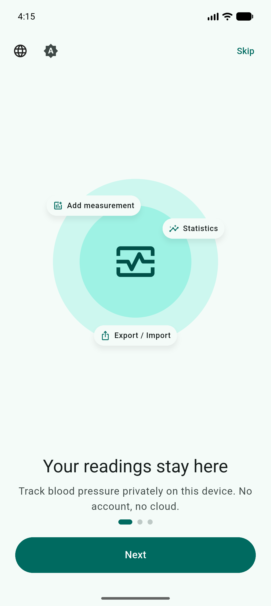

The first saved schedule requests Android notification permission. Grant it to receive operating-system reminders. On this Android 36 emulator, Janan then opened the **Alarms & reminders** setting for exact timing. Enable **Allow setting alarms and reminders** if you want exact alarms; Janan falls back to inexact timing when access is unavailable. The in-app agenda and dose actions remain available if notification permission is denied.

Schedules and dose occurrences are stored in the local `health.db`. Android notifications are rebuilt from active schedules on app startup and after schedule changes. The native widget displays a compact summary written by the app; it does not read the PowerSync database directly.

## Check the next-dose countdown

The blood-pressure home tab places a compact 56 dp countdown circle, matching the Add measurement FAB, where the medicine FAB used to sit. There is no separate medication card in the dashboard body. The circle uses the selected medicine color; its center shows whole hours or minutes (`2h`, `58m`) without seconds. The active countdown omits the pill icon and routine “Next dose” caption; near doses retain their label, while overdue time shows the red ring and elapsed countdown (`+10m`) without a separate “Overdue” caption. The medicine name scales down to fit the available center space. The ring advances as the dose approaches; amber marks the final hour.

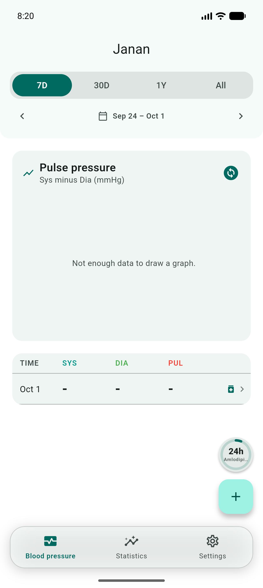

Tap the circle to open its attached dose panel. The panel grows upward from the circle, keeps its edge aligned to the control, and dims the rest of the screen. Its header shows **Next dose** and the number of doses recorded today. The compact medicine-colored dose card shows the medicine and amount, scheduled time and current status, then equal-width **Done**, **+10m**, and **Skip** actions. A **Next up** section lists the following doses in compact, tappable rows. **Log Manual Dose** and **Calendar** sit side by side at the bottom. After a medicine is marked Taken, its next occurrence stays out of the action card until it is within four hours of its scheduled time; during that quiet period a short taken/next-time summary replaces the card. This is checked per occurrence, so a dose scheduled every two hours remains visible when the next dose is within four hours.

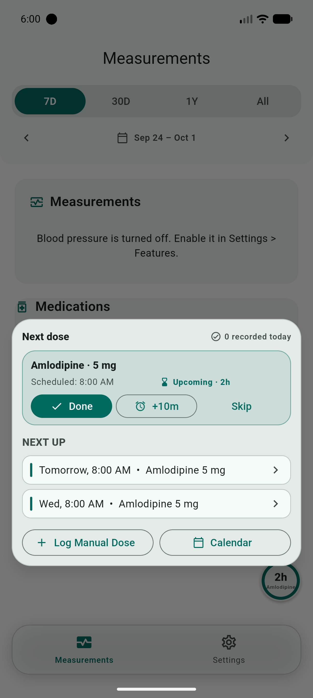

This screenshot was captured on the `emulator-5554` Android emulator with its clock temporarily set to 6:00 AM on a scheduled dose day, so the 8:00 AM dose appears as upcoming in 2h. Automatic date and time was restored after capture.

The Bluetooth launch-sync popout follows the same interaction pattern: its status indicator anchors the panel, the panel fades and scales out from that point, and a dim barrier covers the rest of the app. Tapping outside or closing the panel dismisses it. The emulator has no paired, saved Bluetooth meter, so this walkthrough does not include a live Bluetooth-sync screenshot.

## Create a reminder and record a dose

### 1. Open the reminder list from the countdown

Tap **Today's medicines** in the attached dose panel. With no active schedules, the circular control opens a setup panel with an **Add reminder** action.


### 2. Start from the empty schedule list

The empty state explains that a reminder uses an existing or newly added medicine. Tap **Add reminder**.

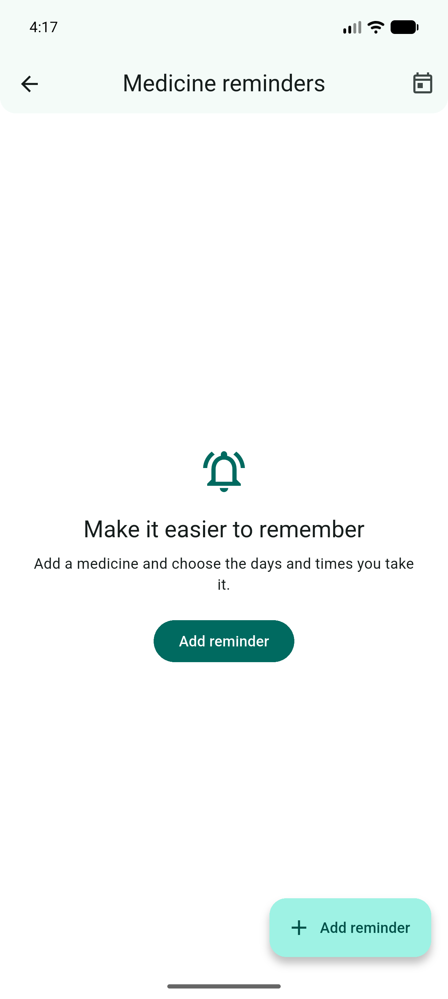

### 3. Open the schedule form

The form collects medicines, dose amounts, times, weekdays, and optional start and end dates.

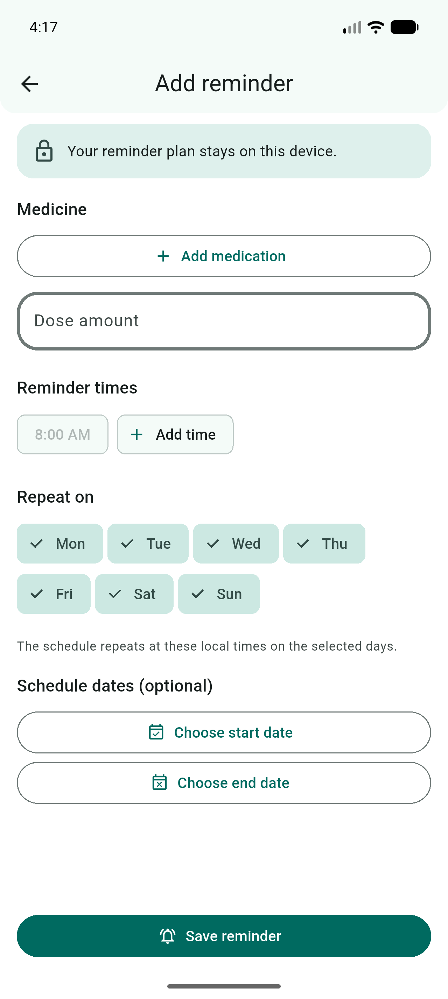

### 4. Choose or add a medicine

Tap the medicine field, then choose an existing medicine or add one from the picker.

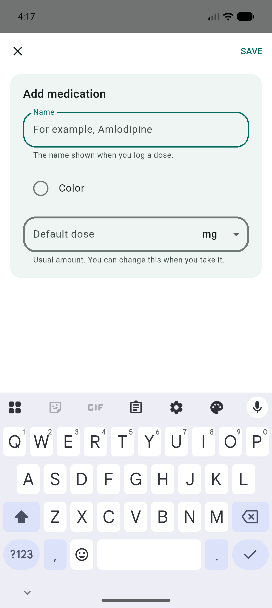

### 5. Set the dose and time

Choose the dose amount and reminder time. This example uses Amlodipine 5 mg at 8:00 AM.

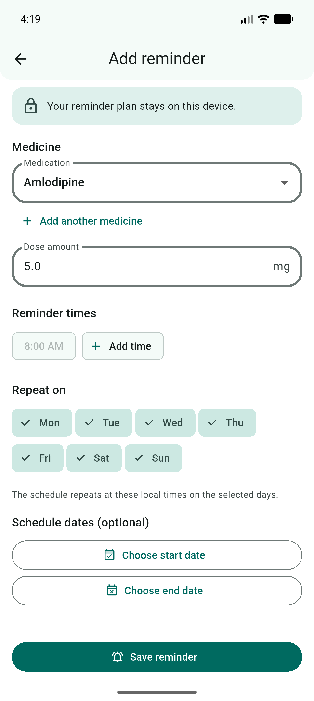

### 6. Choose recurrence days

Select the weekdays for the schedule. The example selects Monday through Friday. Start and end dates can limit the schedule to a date range.

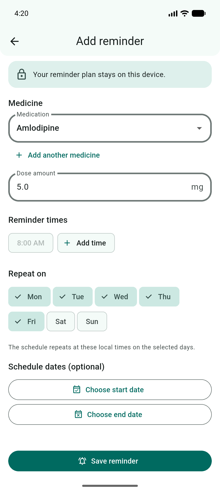

### 7. Allow notifications

Save the schedule and respond to Android's notification permission prompt. If Android opens the exact-alarm setting, enable it there or return to Janan to continue with inexact timing.

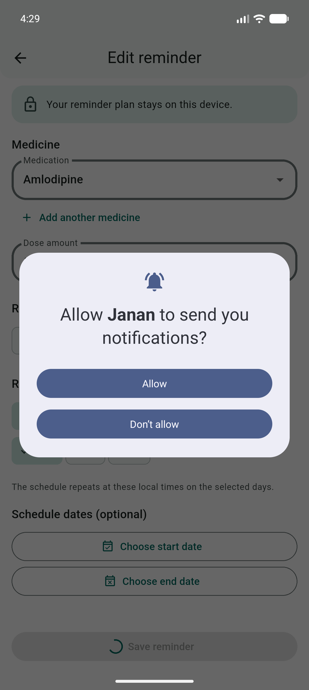

Android opened the exact-alarm setting after the notification prompt on this emulator. The setting is optional; returning without enabling it uses inexact timing.

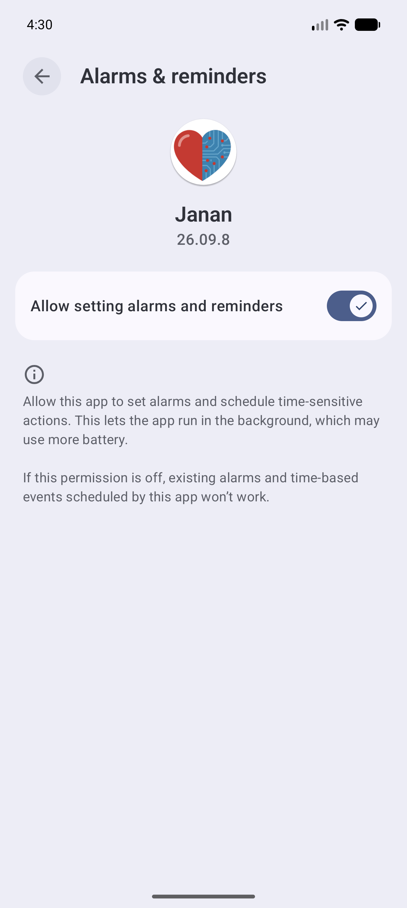

### 8. Review the saved schedule

The schedule list shows the medicine, dose, time, recurrence, and active state. From here, edit or pause the reminder, or open today's agenda.

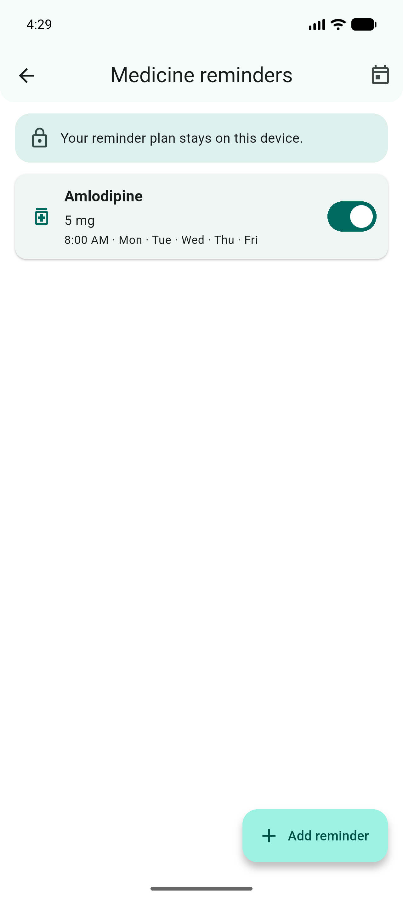

### 9. Open today's agenda

Tap **Today's medicines** in the attached home panel or use the calendar action in the schedule list to open the agenda. Upcoming doses appear in time order with their current status.

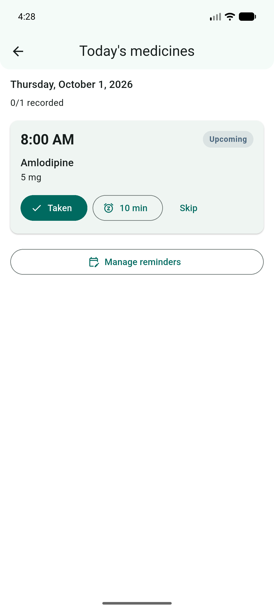

### 10. Snooze a dose

Tap **10 min** on a pending dose. Janan records the snoozed state and schedules a follow-up notification for the snooze time. Snoozing does not record an intake as Taken.

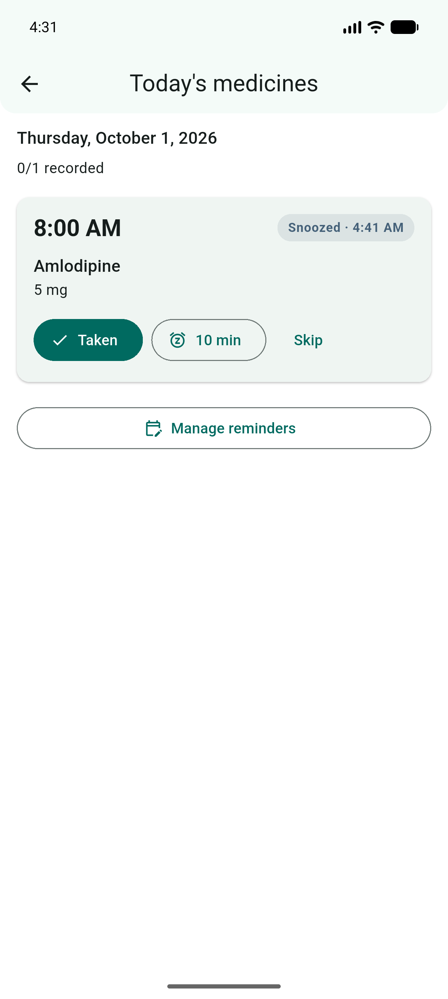

### 11. Record the dose as taken

Tap **Taken** when the dose has actually been taken. Janan records the dose and links the intake to the planned occurrence. The agenda updates its recorded count.

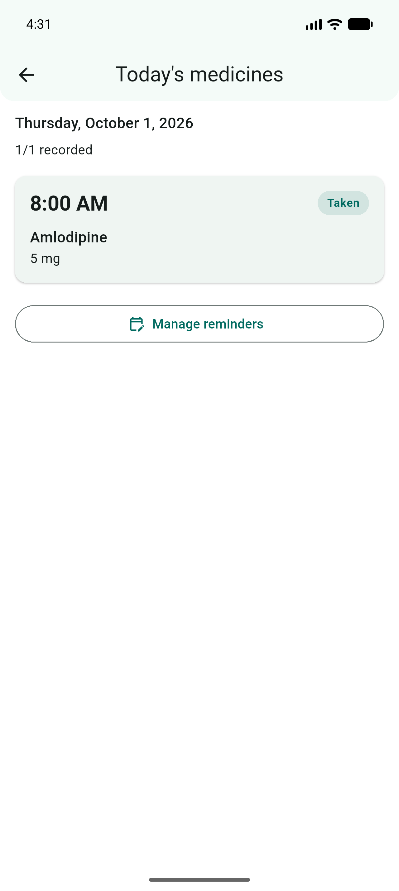

## Add and use the Android widget

The home-screen widget is a native Android app widget sized to one launcher icon cell. It uses the same medicine color and countdown state as the in-app circle. It shows whole hours or minutes without seconds; scheduled refreshes update the ring and label at countdown boundaries, the one-hour threshold, and the dose time.

### 12. Find Janan in the widget picker

Long-press an empty area of the Android home screen, open **Widgets**, search for **Janan**, and drag its circular one-cell countdown onto the home screen. The preview can show placeholder text until the widget instance is placed.

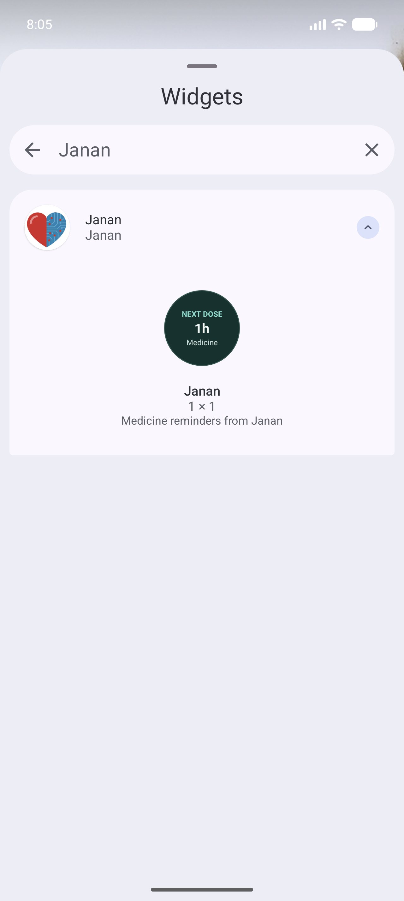

### 13. Review the placed widget

The placed widget shows the next medicine, an hours-or-minutes countdown, and the medicine-colored progress ring. Tap outside the placement outline to finish.

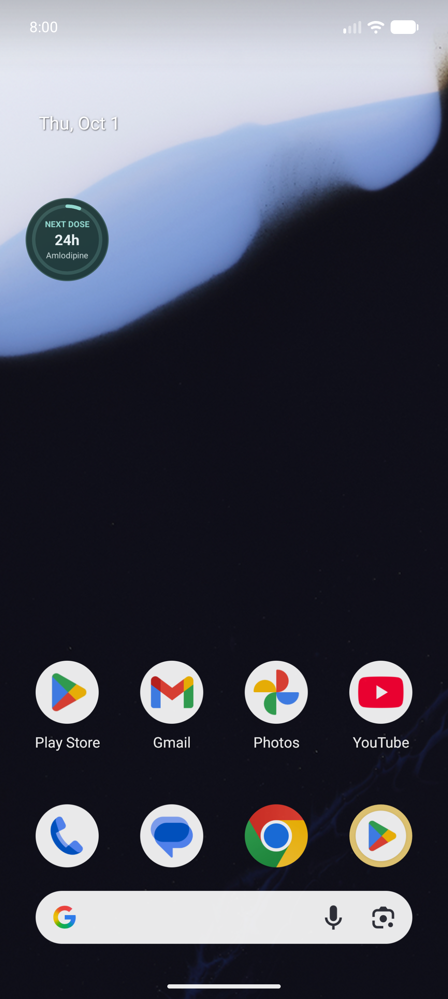

### 14. Open today's agenda from the widget

Tap the circle. Janan opens today's agenda with the next dose state. The widget itself is read-only.

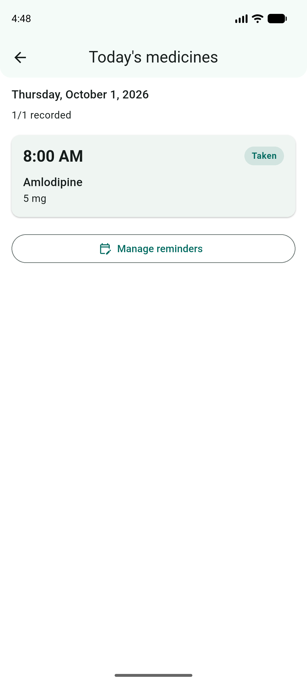

## Capture the near-dose and overdue states

These state examples use the saved weekday schedule for Amlodipine 5 mg at 8:00 AM. Change the emulator clock through Android **Settings → System → Date & time**; leave any other device untouched.

1. Turn off **Set time automatically** and set the emulator to **October 2, 2026, 7:02 AM**. Open Janan and capture the amber `58m` in-app state as `20-home-near-dose.png`. Cold-launch Janan through PolyScreen to refresh its widget summary, press **Home**, and capture the launcher widget as `22-widget-near-dose.png`.
2. Set the emulator to **October 5, 2026, 9:05 AM**, when the next weekday 8:00 AM dose is overdue by about an hour. Cold-launch Janan through PolyScreen, capture the red overdue circle as `21-home-overdue.png`, press **Home**, and capture the widget's elapsed-time state as `23-widget-overdue.png`.
3. Turn **Set time automatically** back on. Cold-launch Janan once, then return to the launcher and confirm the widget reflects the current next dose.

The ring advances as the dose approaches. Within one hour, the label and ring turn amber; after the scheduled time, they turn red and the center switches to elapsed time with a `+` prefix. Both surfaces show hours or minutes only (for example, `58m` and `+5m`), never seconds.

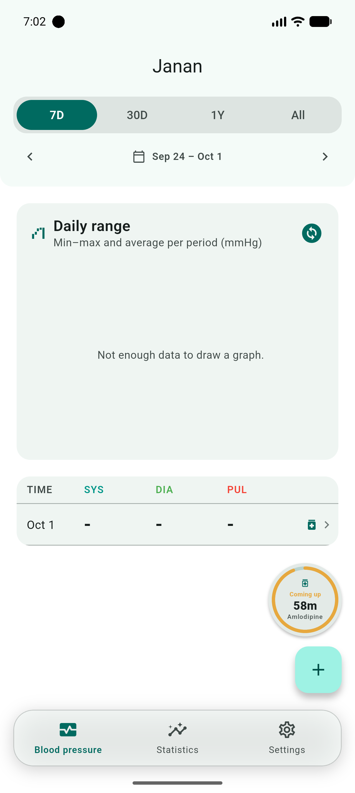

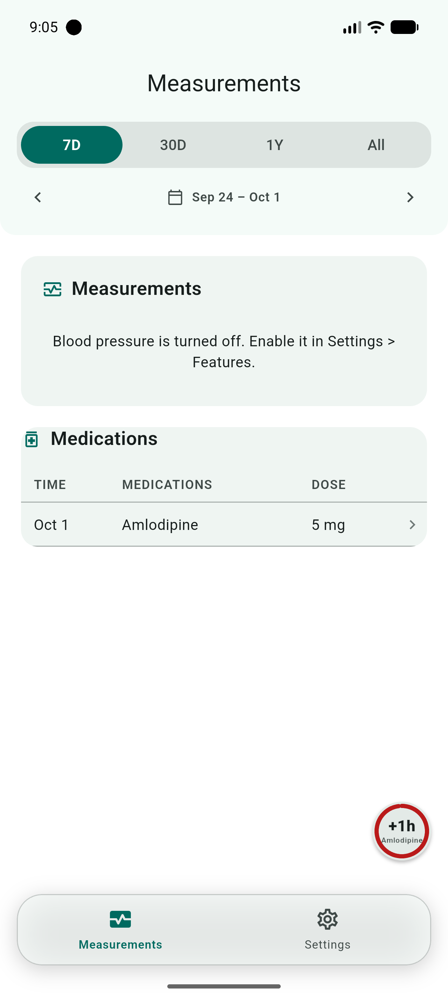

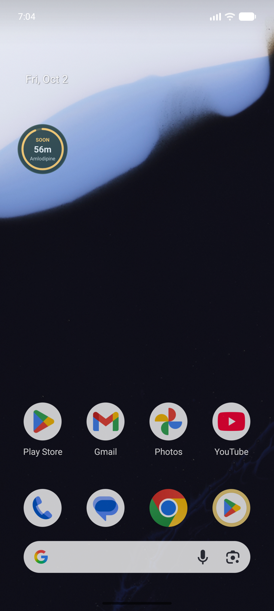

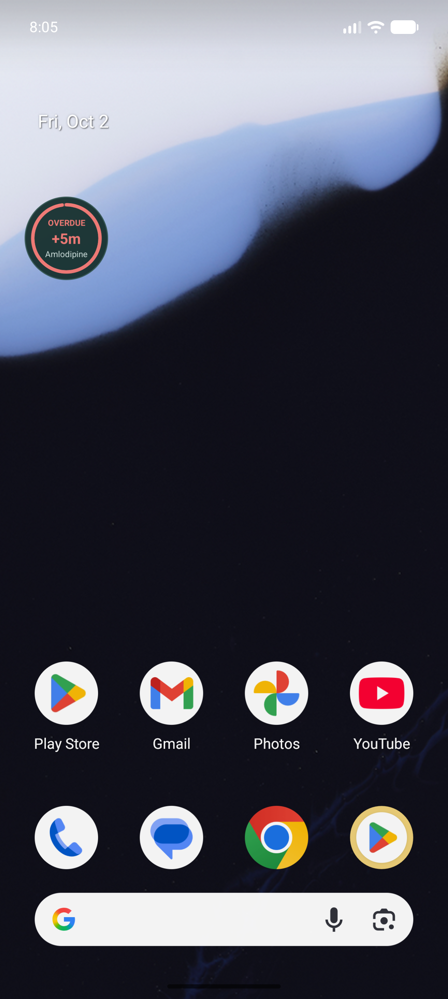

## Capture and validation notes

- Target: `JananCapture` AVD based on the Pixel 10 Pro profile, Android 36.1 Google Play image, device model `sdk_gphone64_x86_64`, serial `emulator-5554`.
- Captures use logical display 0 in portrait at 1280 × 2856 and 480 dpi. UI interaction, date/time setup, launcher widget placement, and screenshots use PolyScreen with that exact serial and display ID.
- `fvm flutter build apk --debug` completed, and the APK was installed without clearing emulator app data. The countdown and attached panel were exercised on the emulator through PolyScreen.
- The app was cold-launched through PolyScreen to refresh the native widget after restoring automatic date and time. ADB was used earlier for build/install diagnostics and `am kill` to simulate a stopped background process while retaining the launcher's cached widget view. All visible screen interaction was performed through PolyScreen.
- The widget's **OPEN TODAY** route was manually verified after the process kill; the final capture shows the Today agenda and the saved Taken state.
- The demo schedule was marked Taken during the walkthrough. It is sample data, not a statement that anyone took the medicine.
